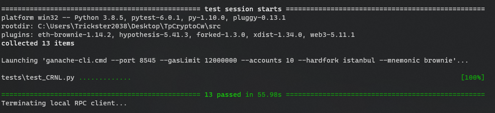

# CRNL: Commit-reveal numeric lottery

Учебный проект в рамках курса "Разработчик криптографических протоколов и децентрализованных систем". Смарт-контракт представляет собой реализацию математической игры "угадать 2/3  среднего" на базе паттерна commit-reveal.

## Концепция

Каждый этап контракта ограничен по времени. 

Первый этап - commit - контракт сохраняет хеши загаданных чисел и принимает ETH (число определено строго, излишки возвращаются на счет sender'a). 

Второй этап - reveal - пользователи отправляют сами загаданные числа, получая назад часть ETH, если число соответствует хешу. 

Третий этап - rewarding - один из пользователей производит вызов функции, вычисляющей 2/3 среднего от открытых (revealed) чисел и находит наиболее близких к этому числу пользователей, сам вызывающий (msg.sender или counter) возвращает себе ETH в размере ставки + часть полученных контрактом комиссий. После вызова этой функции (все еще в тех же временных рамках) победители могут забрать награду (сумма средств за вычетом комиссий и награды counter'a, деленная на число победителей). 

Четвертый этап - удаление контракта - пользователи могут продолжать забирать награды, однако их сохранность не гарантирована, так как может быть вызвана функция уничтожения контракта (остаток ETH  на балансе контракта получает owner или sender в зависимости от настроек контракта).

## Особенности контракта
- защита от превышения gas limit обеспечивается ограничением числа участников
- вызывающий функцию определения победителей (counter) получает награду в виде возврата ETH в размере ставки + часть полученных контрактом комиссий
- контракт предназначен для разового deploy'a, для завершенности системы контрактов необходим Contract Factory (однако попытка его написания приводит к системным ошибкам EVM при компиляции, возможно контракт слишком велик или конструктор слишком сложен)
- после определенного времени, выделенного на получение наград контракт может быть уничтожен
- owner может получить свои комиссии или передать права на контракт на любой фазе его работы

## Состав файлов
- helper/helper.py - Вспомогательная программа, позволяющая генерировать хеш sha256 на основе двух чисел (загадываемого числа и "соли") по алгоритму совпадающему с алгоритмом, используемым при проверке в смарт-контракте.
- src/contracts/ICRNL.sol - интерфейс основного контракта
- src/contracts/CRNL.sol  - основной контракт
- src/contracts/liteCRNL.sol - наследуемый от основного контракт с упрощенным конструктором
- src/tests/test_CRNL.py - тесты для основного и lite контракта

## Сборка проекта
Перед началом использования проекта необходимо установить ряд python-библиотек
```
$ pip install pytest
$ pip install hashlib
```
Далее - перейти в папку solidity-проекта и скомпилировать его
```
$ cd src
$ brownie compile
```
После этого можно запустить заготовленные тесты
```
$ brownie test
```
Или перейти к ручному тестированию (основные методы контракта см. в исходном коде или в test_CRNL.py)
```
$ brownie console
```
## Результаты тестов



## Структура тестов
В основном тесты покрывают следующие условия:
- нормальное взаимодействие с контрактом + проверка изменения балансов
- проверка работы модификаторов времени (каждая фаза работы контракта: commit, reveal, reward, distruct доступна ограниченное время)
- проверка последовательности этапов (транзакция отклоняется при попытке reveal без commit до этого и т.д.)
- проверка невозможности повторного вызова commit, reveal, подсчета награды и взятия награды (однако есть отдельный метод, позволяющий изменить hash загаданного числа на фазе commit)
- проверка правильности разделения наград и распределения комиссий
- проверка невозможности reveal при несовпадении хеша загаданного числа с хешем на фазе commit
- проверка выплаты наград за уничтожение контракта
- проверка передачи прав владения контрактом

## Базовая схема взаимодействия с контрактом

(действия указаны в хронологическом порядке)

- deploy контракта - задаются ограничения, размер ставки и комиссий, временные интервалы этапов работы
- commit - отправка hash(N+salt) и выплата ставки, гарантии reveal и комиссий
- reveal - отправка N, salt - проверка совпадения хешей, возвращение средств гарантировавших reveal при успехе
- подсчет 2/3 среднего N и минимальной разницы между Ni и 2/3 AVG  - в качестве мотивации к вызову метода выступает возврат ставки и выплата дополнительной комиссии вызывающему
- каждый участник вызывает takeReward( ), если Ni = min(|Ni-2/3 AVG|) - выплачивается награда
- вызывается уничтожение контракта - награду получает owner или вызывающий (зависит от параметров, настроенных в конструкторе)

